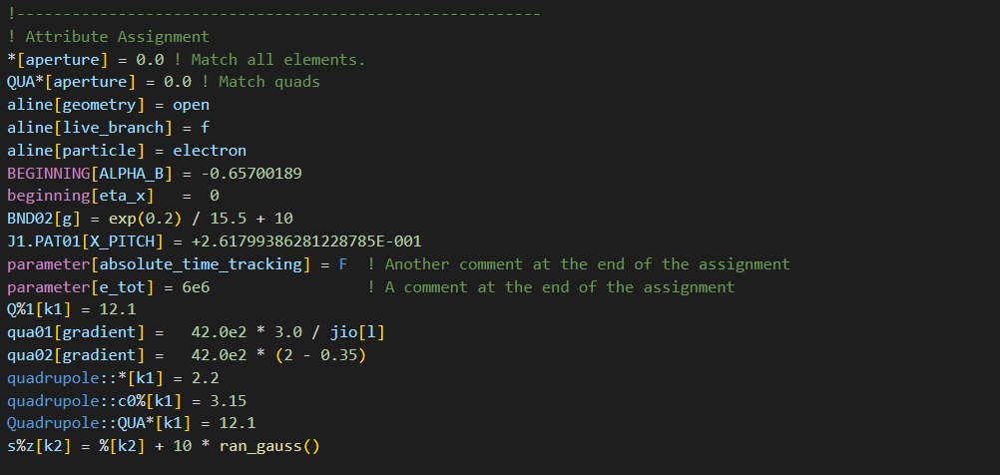
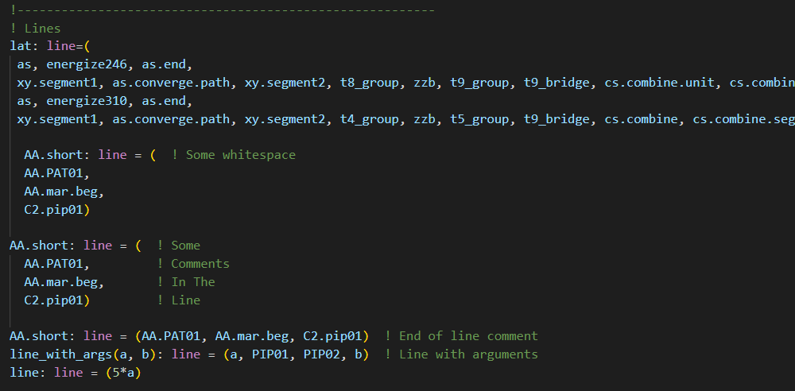

# VSCode Bmad Language Extension

This extension provides language support for [Bmad](https://github.com/bmad-sim/bmad-ecosystem), the particle accelerator design toolkit.
Currently, syntax highlighting is supported for Bmad lattice files.
Future work will focus on also covering scripts and configuration files for tao.

## Features

The extension currently supports the following features for Bmad lattice files.
 * Support for VSCode bulk commenting
 * Syntax highlighting for the following entities
   * Comments
   * Element names (including following all rules in Bmad manual)
   * Element attribute assignements
   * Element definitions
   * Line definitions
   * Constant definitions
   * Call statements
   * Use statements
   * Print statements
   * Title statements
   * Literals (string, numeric, boolean)
   * Bmad keywords
   * Species names
   * Numerical constants
   * Built-in numerical functions

## Screenshots

## Contributing

If there is a feature you would like to see implemented, or you notice a problem with the current package please leave us a note in the issues tab on Github.
Please leave as much detail as possible and screenshots where appropriate (especially if it is a syntax highlighting problem).
All feedback is appreciated!
